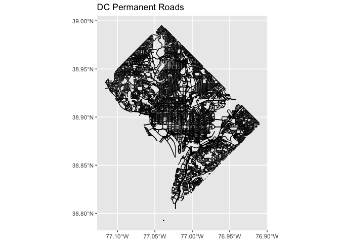
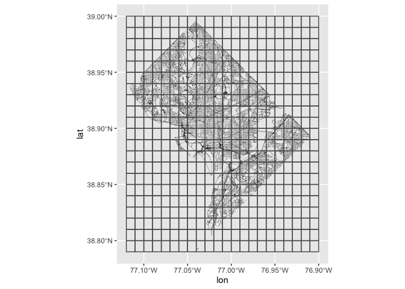
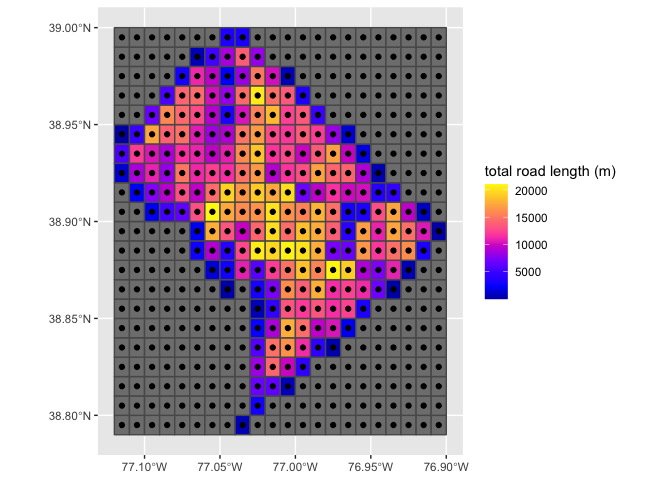
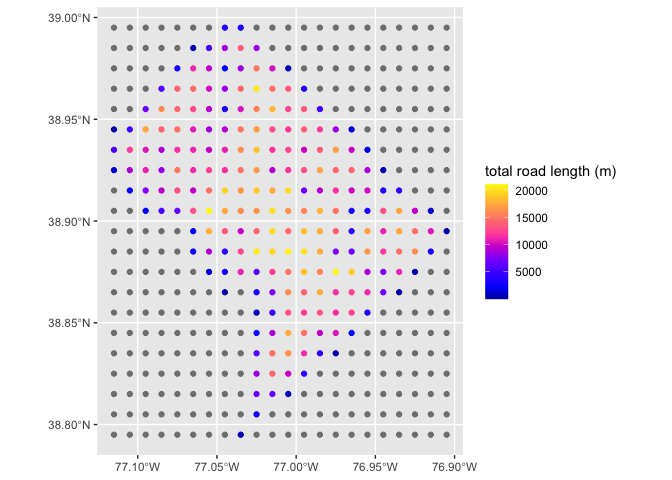
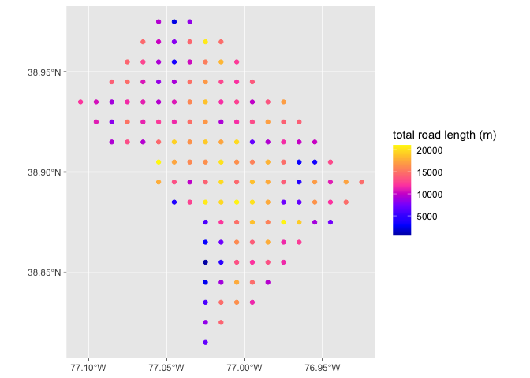

Vector label generation
================
Benjamin Shenouda, Trinetta Chong, Eugenio Noda, Tamma Carleton
2022-06-24

# Making predictions from vector data

This notebook demonstrates the steps to prepare vector data to make
predictions using MOSAIKS features. This notebook makes use of data on
roads in the DC area, downloaded from
[USGS](https://prd-tnm.s3.amazonaws.com/index.html?prefix=StagedProducts/Tran/Shape/).

## 1. Load shapefile

``` r
suppressPackageStartupMessages(library(sf))
suppressPackageStartupMessages(library(dplyr))
suppressPackageStartupMessages(library(mapview))
suppressPackageStartupMessages(library(ggplot2))
suppressPackageStartupMessages(library(rgdal))
suppressPackageStartupMessages(library(glmnet))
suppressPackageStartupMessages(library(patchwork))
suppressPackageStartupMessages(library(lwgeom))
suppressPackageStartupMessages(library(units))
```

Prepare directories and files

``` r
input_dir <-  './' #input path to working directory
label_shp_name <-  'TRAN_District_of_Columbia_State_Shape/Shape/Trans_RoadSegment.shp'
target_crs <-  4326 # epsg:4326, the projection of the MOSAIKS grid

label_shp <- st_read(paste0(input_dir, label_shp_name)) # read in shapefile using sf package
```

    ## Reading layer `Trans_RoadSegment' from data source 
    ##   `/Users/benshen/CEGA/api_testing/line_to_predict/TRAN_District_of_Columbia_State_Shape/Shape/Trans_RoadSegment.shp' 
    ##   using driver `ESRI Shapefile'
    ## Simple feature collection with 16408 features and 26 fields
    ## Geometry type: MULTILINESTRING
    ## Dimension:     XY
    ## Bounding box:  xmin: -77.11675 ymin: 38.79241 xmax: -76.90956 ymax: 38.99525
    ## Geodetic CRS:  NAD83

``` r
label_shp_reprojected <- st_transform(label_shp, crs = target_crs) # if needed, reproject shapefile to epsg:4326
```

Inspect shapefile and data

``` r
ggplot() +
  geom_sf(data = label_shp_reprojected[,"permanent_"]) +
  labs(title = "DC Permanent Roads")
```

<!-- -->

## 2. Create grid

Similar to the process for polygon data, in this step, we create a *grid
of polygon cells*, and constrain it by the bounding box of the label
data. The specified resolution represents the desired resolution at
which predictions are later made.

The grid cells allow us to sum the total length of road segments that
fall within each cell, and generate in a next step a tabular dataset of
lon/lat coordinates (at the centroid of each cell) with a corresponding
value equal to the sum of all road lengths within that cell.

A `target_resolution <- .01` signifies a 0.01 x 0.01 degree
latitude-longitude grid, centered at 0.005 degree intervals (0.01
degrees is approximately equivalent to 1.11 km at the equator using an
equal angle grid). This resolution is equivalent to that of the MOSAIKS
API features.

In many cases, one can make predictions at a finer resolution than the
native resolution of input label data. For example, the native
resolution of this label is at the canton administrative level (as seen
in the shapefile plot). However, by overlaying our desired grid onto the
shapefile and performing a spatial join, we are able to assign label
values to each unique cell on a 0.01 x 0.01 degree grid. One should note
that increasing the resolution will increase compute time.

``` r
target_resolution <- .01 # Set target resolution. A resolution of .01 is equal to the .01 x .01 dense grid of the MOSAIKS API.

label_bbox <- st_bbox(label_shp_reprojected, crs = target_crs) # get bounding box of shapefile
#bbox_poly <- bbox_to_poly(label_bbox)
#st_as_sfc(label_bbox)

# Creates grid of at specified resolution starting at the min x and min y coordinates of the label bounding box

grid_cells <- st_make_grid(label_shp_reprojected, 
        cellsize = target_resolution, # cell size intervals for the grid, can be modified for higher or lower resolution -> .01 is equal to the MOSAIKS dense grid
        what = 'polygons', # to render polgyon square cells
        offset = c(round(label_bbox[1], 2), round(label_bbox[2], 2))) # starting at the min x and y of the bbox rounded to 3 digit precision of the MOSAIKS grid
```

Plot grid over vector shapefile

``` r
# Plot grid over lines
ggplot() +
  geom_sf(data = label_shp_reprojected[,"permanent_"], lwd = 0.09) +
  geom_sf(data = grid_cells, fill = 'transparent', lwd = 0.5) +
  coord_sf(datum = 4326)  +
  labs(x = "lon", y = "lat")
```

<!-- -->

## 3. Spatially join the grid with label shapefile and sum lengths of road in each cell (at .01 resolution, this takes a bit of time)

``` r
# rename files for easier reading
line <- label_shp_reprojected
poly <- grid_cells

poly_sf <- st_as_sf(poly) # convert grid cells from sfc to sf object for manipulation

intersection <- st_intersection(line, poly) # find line segments that correspond to each grid cell (takes time)
```

    ## Warning: attribute variables are assumed to be spatially constant throughout all
    ## geometries

``` r
intersection$len <- st_length(intersection) # calculate length of each line segment in each cell

poly_sf$id <- 1:nrow(poly_sf) # create id for each cell

join <- st_join(poly_sf, intersection) # join the lengths of each line segment to its corresponding polygon

grid_length <- group_by(join, id) %>% #  sum length of all line segments in each cell by cell id
  summarize(length = sum(len))

#grid_length1 <- filter(grid_length, !is.na(length)) # filter out cells without line segments

mutate(grid_length, length = ifelse(is.na(length), 0, length)) # or set length to 0 for cells without lines
```

    ## Simple feature collection with 462 features and 2 fields
    ## Geometry type: POLYGON
    ## Dimension:     XY
    ## Bounding box:  xmin: -77.12 ymin: 38.79 xmax: -76.9 ymax: 39
    ## Geodetic CRS:  WGS 84
    ## # A tibble: 462 × 3
    ##       id length                                                                x
    ##  * <int>  <dbl>                                                    <POLYGON [°]>
    ##  1     1     0  ((-77.12 38.79, -77.11 38.79, -77.11 38.8, -77.12 38.8, -77.12 …
    ##  2     2     0  ((-77.11 38.79, -77.1 38.79, -77.1 38.8, -77.11 38.8, -77.11 38…
    ##  3     3     0  ((-77.1 38.79, -77.09 38.79, -77.09 38.8, -77.1 38.8, -77.1 38.…
    ##  4     4     0  ((-77.09 38.79, -77.08 38.79, -77.08 38.8, -77.09 38.8, -77.09 …
    ##  5     5     0  ((-77.08 38.79, -77.07 38.79, -77.07 38.8, -77.08 38.8, -77.08 …
    ##  6     6     0  ((-77.07 38.79, -77.06 38.79, -77.06 38.8, -77.07 38.8, -77.07 …
    ##  7     7     0  ((-77.06 38.79, -77.05 38.79, -77.05 38.8, -77.06 38.8, -77.06 …
    ##  8     8     0  ((-77.05 38.79, -77.04 38.79, -77.04 38.8, -77.05 38.8, -77.05 …
    ##  9     9   446. ((-77.04 38.79, -77.03 38.79, -77.03 38.8, -77.04 38.8, -77.04 …
    ## 10    10     0  ((-77.03 38.79, -77.02 38.79, -77.02 38.8, -77.03 38.8, -77.03 …
    ## # … with 452 more rows

``` r
head(grid_length)
```

    ## Simple feature collection with 6 features and 2 fields
    ## Geometry type: POLYGON
    ## Dimension:     XY
    ## Bounding box:  xmin: -77.12 ymin: 38.79 xmax: -77.06 ymax: 38.8
    ## Geodetic CRS:  WGS 84
    ## # A tibble: 6 × 3
    ##      id length                                                                 x
    ##   <int>    [m]                                                     <POLYGON [°]>
    ## 1     1     NA ((-77.12 38.79, -77.11 38.79, -77.11 38.8, -77.12 38.8, -77.12 3…
    ## 2     2     NA ((-77.11 38.79, -77.1 38.79, -77.1 38.8, -77.11 38.8, -77.11 38.…
    ## 3     3     NA ((-77.1 38.79, -77.09 38.79, -77.09 38.8, -77.1 38.8, -77.1 38.7…
    ## 4     4     NA ((-77.09 38.79, -77.08 38.79, -77.08 38.8, -77.09 38.8, -77.09 3…
    ## 5     5     NA ((-77.08 38.79, -77.07 38.79, -77.07 38.8, -77.08 38.8, -77.08 3…
    ## 6     6     NA ((-77.07 38.79, -77.06 38.79, -77.06 38.8, -77.07 38.8, -77.07 3…

``` r
grid_length <- drop_units(grid_length) # drop units feature for easy manipulation. Length is in meters

ggplot() +
  geom_sf(data = grid_length, aes(fill = length)) +
  scale_fill_gradientn(colors = sf.colors()) +
  labs(fill = "total road length (m)")
```

<!-- -->

``` r
centroids <- st_centroid(grid_length) # get points at centroid of each grid cell
```

    ## Warning in st_centroid.sf(grid_length): st_centroid assumes attributes are
    ## constant over geometries of x

``` r
# Visualize
ggplot() +
  geom_sf(data = grid_length, aes(fill = length)) +
  scale_fill_gradientn(colors = sf.colors()) + 
  geom_sf(data = centroids) +
  labs(fill = "total road length (m)")
```

<!-- -->

Extract grid cell values to centroids

``` r
grid_points <- st_join(centroids, grid_length, join = st_within) # spatial join

# Visualize
ggplot() +
  geom_sf(data = grid_points, aes(color = length.x)) +
  scale_color_gradientn(colors = sf.colors()) +
  labs(color = "total road length (m)")
```

<!-- -->

``` r
head(grid_points)
```

    ## Simple feature collection with 6 features and 4 fields
    ## Geometry type: POINT
    ## Dimension:     XY
    ## Bounding box:  xmin: -77.115 ymin: 38.795 xmax: -77.065 ymax: 38.795
    ## Geodetic CRS:  WGS 84
    ## # A tibble: 6 × 5
    ##    id.x length.x                x  id.y length.y
    ##   <int>    <dbl>      <POINT [°]> <int>    <dbl>
    ## 1     1       NA (-77.115 38.795)     1       NA
    ## 2     2       NA (-77.105 38.795)     2       NA
    ## 3     3       NA (-77.095 38.795)     3       NA
    ## 4     4       NA (-77.085 38.795)     4       NA
    ## 5     5       NA (-77.075 38.795)     5       NA
    ## 6     6       NA (-77.065 38.795)     6       NA

############ 

Plot check



## 4. Output the grid to CSV to obtain features from File Query

    ## Writing layer `dc_roads' to data source `./dc_roads.csv' using driver `CSV'
    ## Writing 462 features with 3 fields and geometry type Point.
