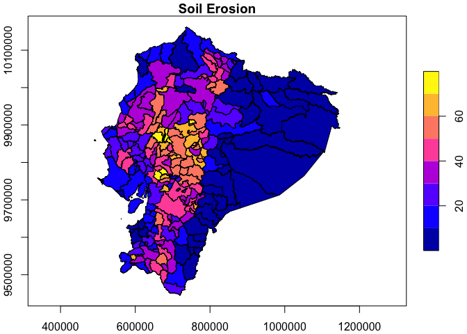
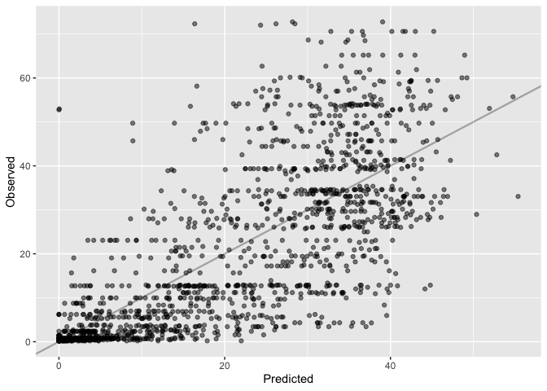
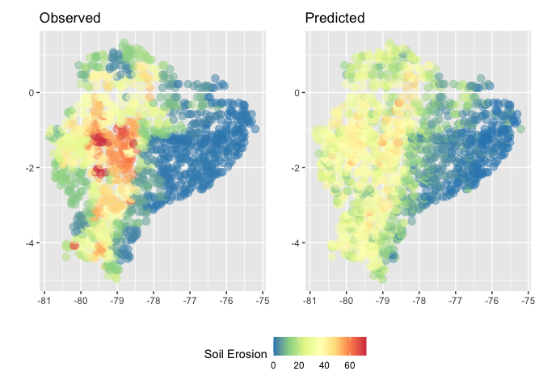

Shapefile to predictions
================
Benjamin Shenouda, Trinetta Chong, Eugenio Noda
2022-06-09

# Making predictions from label data

This notebook demonstrates the steps in the process of making
predictions starting from your own shapefile label data. The process can
be divided into 7 steps

1.  Load and prepare the shape file
2.  Create a grid according to the desired resolution at which you would
    like to generate predictions
3.  Create crosswalk from the grid to the polygon, matching each point
    in the grid to corresponding polygon value
4.  Output the new grid label dataset to a CSV file for use in the
    MOSAIKS API File Query
5.  Using the label crosswalk from step 3, merge label data with the
    MOSAIKS features obtained through the API File Query
6.  With the merged dataset containing point data for labels and
    features, split dataset into training and testing sets to learn the
    relationship between the label attribute and the visual imagery
    captured by the features using a ridge regression
7.  Use the trained model from the previous step to make predictions on
    the test subset, evaluating performance and visualizing the results

## 1. Preparing shapefile

``` r
suppressPackageStartupMessages(library(sf))
suppressPackageStartupMessages(library(dplyr))
suppressPackageStartupMessages(library(mapview))
suppressPackageStartupMessages(library(ggplot2))
suppressPackageStartupMessages(library(rgdal))
suppressPackageStartupMessages(library(glmnet))
suppressPackageStartupMessages(library(patchwork))
```

Prepare directories and files

``` r
input_dir <-  './'
label_shp_name <-  'ecu_soil_erosion_data/ecu_ica_landdegradation_geonode_jul2018.shp'
target_crs <-  4326 # epsg:4326, the projection of the MOSAIKS grid

label_shp <- st_read(paste0(input_dir, label_shp_name)) # read in shapefile using sf package
```

    ## Reading layer `ecu_ica_landdegradation_geonode_jul2018' from data source 
    ##   `/Users/benshen/CEGA/api_testing/ecu_soil_erosion_data/ecu_ica_landdegradation_geonode_jul2018.shp' 
    ##   using driver `ESRI Shapefile'
    ## Simple feature collection with 224 features and 9 fields
    ## Geometry type: MULTIPOLYGON
    ## Dimension:     XY
    ## Bounding box:  xmin: 490578.4 ymin: 9445217 xmax: 1147852 ymax: 10162550
    ## Projected CRS: WGS 84 / UTM zone 17S

``` r
label_shp_reprojected <- st_transform(label_shp, crs = target_crs) # if needed, reproject shapefile to epsg:4326
```

Inspect data

``` r
plot(label_shp[,"ErosPr"], axes = T, main= "Soil Erosion") # Plot variable "soil erosion index" ErosPr
```

<!-- -->

## 2. Create grid

In this step we create a grid bound by the bounding box of the label
data and to the specified resolution. This allows us later to perform a
spatial join on the datasets to extract label values at lon/lat
coordinates for use in the API File Query.

The target resolution in this step represents the resolution at which
label predictions are desired in later steps. At
`target_resolution <- .01`, the resolution will be equal to the MOSAIKS
dense grid. Resolution can be adjusted to make predictions at finer
resolution than the native resolution of input label data, up to .01x.01
degrees.

Increasing the resolution will increase compute time. To take full
advantage of the platform, resolution should be set to the maximum
`target_resolution <- .01` degrees. This demo uses a resolution
`target_resolution <- .05` to save compute time for illustration
purposes.

``` r
target_resolution <- .05 # Set target resolution. A resolution of .01 is equal to the .01 x .01 dense grid of the MOSAIKS API.

label_bbox <- st_bbox(label_shp_reprojected) # get bounding box of shapefile


# Creates grid of at specified resolution starting at the min x and min y coordinates of the label bounding box

grid <- st_make_grid(label_shp_reprojected, 
        cellsize = target_resolution, # cell size intervals for the grid, can be modified for higher or lower resolution -> .01 is equal to the MOSAIKS dense grid
        what = 'centers', # to render points at the centroids of each grid cell
        offset = c(round(label_bbox[1], 2), round(label_bbox[2]), 2)) # starting at the min x and y of the bbox rounded to 3 digit precision of the MOSAIKS grid
```

Plot grid over shapefile

``` r
# Plot grid over shp with values
ggplot() +
  geom_sf(data = label_shp_reprojected, aes(fill = ErosPr), lwd = 0.09) +
  scale_fill_gradientn(colors = sf.colors()) + 
  geom_sf(data = grid, fill = 'transparent', lwd = 0.01) +
  coord_sf(datum = 4326)  +
  labs(x = "", y = "", fill = "Soil Erosion")
```

<!-- -->

## 3. Spatially join the grid with label shapefile

In this step, the generated grid is used to extract label values at
their lon/lat coordinates.

``` r
grid_sf <- st_as_sf(grid) # transform grid from sfc object to sf object for merging

label_df<- st_join(grid_sf, label_shp_reprojected[,"ErosPr"], join = st_within, left = FALSE) # spatial join grid over shapefile, "ErosPr" is the desired attribute column of the example dataset
```

Plot check


## 4. Output the grid to CSV to obtain features from File Query

    ## Writing layer `ecu_erosion_label' to data source 
    ##   `./ecu_erosion_label.csv' using driver `CSV'
    ## Writing 8074 features with 3 fields and geometry type Point.

# Making predictions

Using the newly created label CSV, features can be obtained from the
MOSAIKS API file query. Once features are downloaded, they can be merged
with label data to make predictions

## 5. Load and merge features and label data

Load and inspect features

``` r
#load features (this may take a few mins), and label data
features <- read.csv(paste0(input_dir,'Mosaiks_features.csv'), header = T, stringsAsFactors = F)

head(features, c(5, 10)) # Limit output to 10 columns for sake of space. Actual dataframe contains 4002 columns.
```

    ##      Lat     Lon          X        X.1        X.2          X.3        X.4
    ## 1 -0.925 -77.305 0.06687240 0.12104105 0.08847056 4.674185e-03 0.06932612
    ## 2 -1.025 -77.305 0.06070738 0.08679849 0.09487789 2.784403e-04 0.05385127
    ## 3 -1.075 -77.305 0.07271444 0.10513716 0.09843686 1.760430e-05 0.06603616
    ## 4 -1.125 -77.305 0.07507450 0.10844446 0.10641507 2.963531e-05 0.06811752
    ## 5 -1.175 -77.305 0.07678302 0.10888809 0.10648130 6.757053e-05 0.07007837
    ##         X.5        X.6       X.7
    ## 1 0.1553144 0.10463028 0.5648764
    ## 2 0.1146531 0.08121043 0.6064681
    ## 3 0.1374398 0.08497297 0.6135941
    ## 4 0.1511175 0.09372936 0.6323367
    ## 5 0.1531822 0.09893279 0.6484400

Load and inspect label data

``` r
label_filename = 'ecu_erosion_label.csv' # filename of the output csv from step 4
label <- read.csv(paste0(input_dir, label_filename), header = T, stringsAsFactors = F)

head(label, 5)
```

    ##    ErosPr     lon    lat
    ## 1 21.4603 -79.105 -4.975
    ## 2 21.4603 -79.055 -4.975
    ## 3 21.4603 -79.005 -4.975
    ## 4 21.4603 -79.255 -4.925
    ## 5 21.4603 -79.205 -4.925

Merge features spatially with label

Here, we merge our downloaded features (“X”) with our label (“y”) based
on the location of grid cells. This results in a single dataset with a
vector of MOSAIKS features associated with each label observation. Each
row in this dataset represents a label and features for a given
<u>***0.01 x 0.01 grid cell***</u>. <u>**(resolution according to the
specified grid resolution of the generated label grid)**</u>

``` r
#merge features with label
df <- left_join(label, features, by = c("lat"="Lat", "lon" = "Lon"))
print(paste(nrow(df), "observations in merged dataframe"))
```

    ## [1] "8074 observations in merged dataframe"

``` r
#drop NAs
num_na <- nrow(df) - nrow(na.omit(df)) # get number of rows with NAs
df <- na.omit(df) # drop NAs from dataframe
print(paste0(num_na, " rows with NAs dropped. ", nrow(df), " observations in final dataframe."))
```

    ## [1] "1220 rows with NAs dropped. 6854 observations in final dataframe."

``` r
head(df, c(5, 10)) # limited to 10 columns for sake of space. Actual dataframe contains 4003 columns
```

    ##    ErosPr     lon    lat          X        X.1        X.2          X.3
    ## 1 21.4603 -79.105 -4.975 0.16587991 0.42999491 0.13084383 0.0547036342
    ## 2 21.4603 -79.055 -4.975 0.13666266 0.25447765 0.13536981 0.0285860952
    ## 3 21.4603 -79.005 -4.975 0.10358148 0.17465281 0.11631227 0.0156488381
    ## 4 21.4603 -79.255 -4.925 0.04870118 0.08788871 0.05642445 0.0027059496
    ## 5 21.4603 -79.205 -4.925 0.05220752 0.08975811 0.04581843 0.0007529163
    ##          X.4       X.5        X.6
    ## 1 0.24663417 0.5299929 0.20095651
    ## 2 0.15804757 0.3605235 0.18017522
    ## 3 0.10863219 0.2195943 0.12967739
    ## 4 0.04756720 0.1608833 0.08749487
    ## 5 0.05369745 0.1631556 0.06835839

## 6. Run a ridge regression of label on MOSAIKS features

This step learns how the visual information in the imagery, as captured
by the features, relates to the labels.

Before performing a ridge regression, we first split our data into train
(80%) and test (20%). We will estimate the models on the train set and
then evaluate predictions in the test set. This separation of train and
test set is important to address issues related to overfitting.

``` r
### Split data into training and test sets
set.seed(100) 

index <- sample(1:nrow(df), 0.8*nrow(df)) 

train <- df[index,] # Create the training data 
test <- df[-index,] # Create the test data

#label_value <- ErosPr # set label attribute name in the dataframe, modify according to dataset

# Create X matricies and y vectors from the train and test sets
# Note that the glmnet function does not work with dataframes, so we need to create a numeric matrix for the training features 

X_train <- as.matrix(subset(train, select = -c(ErosPr)))  #change value to match label attribute
y_train <- train$ErosPr                                   #change value to match label attribute

X_test <- as.matrix(subset(test, select = -c(ErosPr)))    #change value to match label attribute
y_test <- test$ErosPr                                     #change value to match label attribute

#save test set lat/lons for later
plotting_coords <- subset(test, select = c(lon,lat))
```

Within our training dataset, we choose the penalization parameter in the
ridge regression via k-fold cross-validation (here, k=5).

``` r
# Train the ridge regression model, choosing the penalization parameter using cross-validation in the train set.
cv_ridge <- cv.glmnet(X_train, y_train, 
                      alpha = 0, # ridge regression
                      nfolds = 5)

# summarize chosen configuration 
optimal_lambda <- cv_ridge$lambda.min
print(paste0("optimal lambda: ", optimal_lambda))
```

    ## [1] "optimal lambda: 1.11481134254125"

## 7. Make predictions and evaluate performance

Next, we use the trained model to make predictions in the test set.

``` r
#predict model
y_pred <- predict(cv_ridge, s = optimal_lambda, newx = X_test)
```

We can then evaluate performance in the test set by comparing
predictions to the label data.

``` r
# Compute R^2 from true and predicted values
SSE <- sum((y_pred - y_test)^2)
SST <- sum((y_test - mean(y_test))^2)
r2 <- (1 - SSE / SST)

print(paste0('r2: ', r2))
```

    ## [1] "r2: 0.574399219105495"

We can also make a scatter plot of labeled data against predictions.

``` r
#clip bounds so min value = 0 because we know that treecover cannot be below zero. 
y_pred[y_pred<0] <- 0

#combine lat/lons with test and predicted values into a dataframe
map_plot <- data.frame(plotting_coords, y_pred, y_test) 
names(map_plot) <- c('lon','lat','predicted','observed')

#scatterplot
ggplot(map_plot, aes(x=y_pred, y=y_test)) + 
geom_point() +
geom_abline(intercept = 0, slope = 1, size = 0.8) + # 45 degree line
labs(x = "Predicted", y = "Observed") 
```

<!-- -->

Finally, we can compare the spatial distribution of label
(i.e. observed) values with predicted values.


